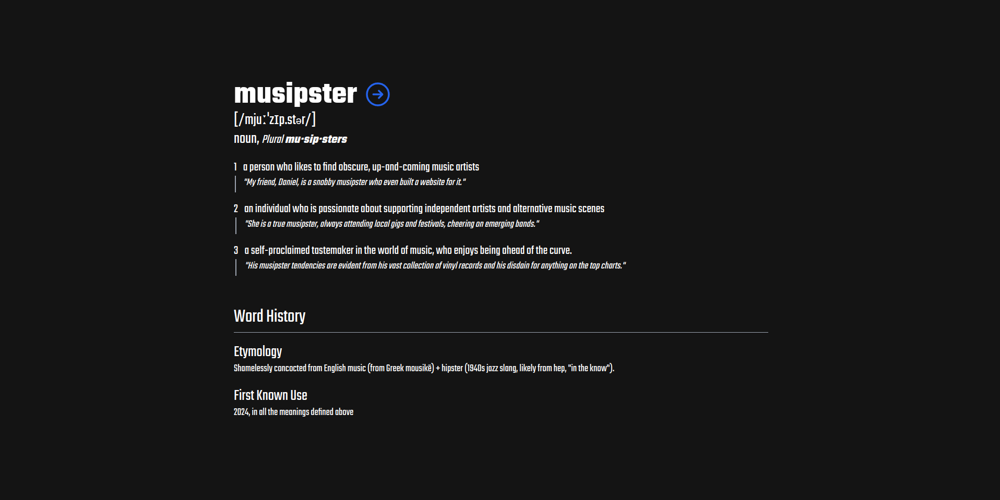
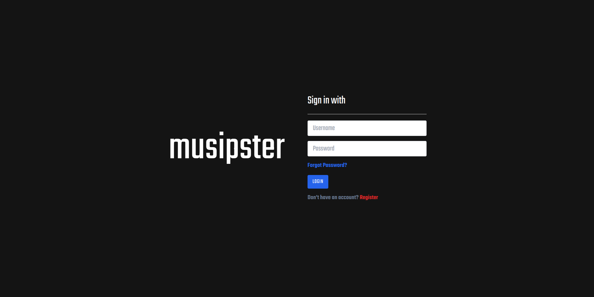
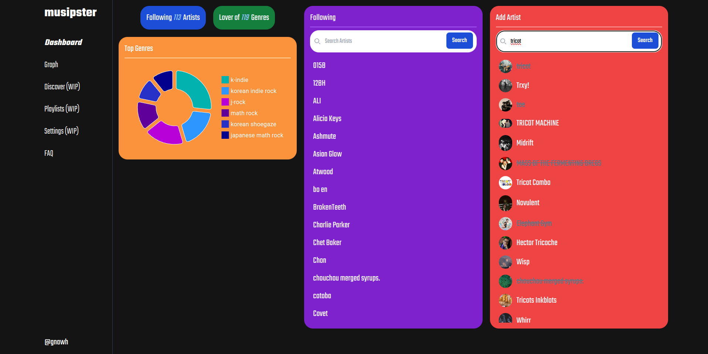
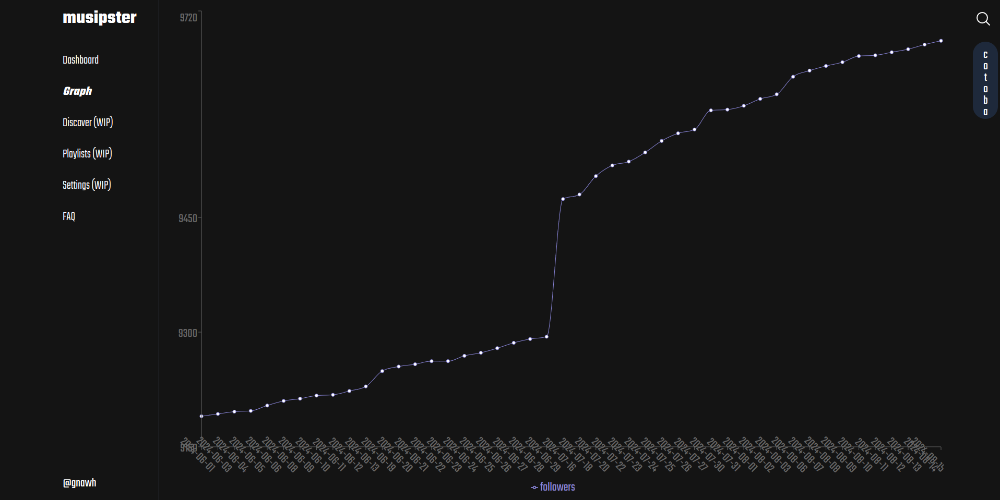
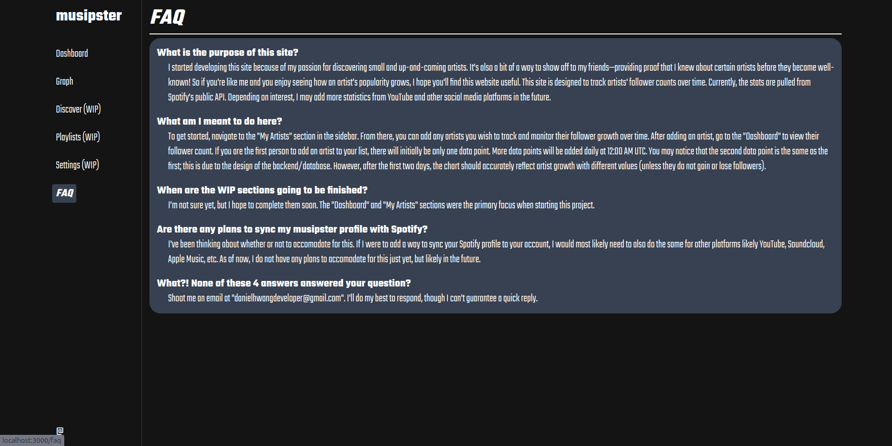

# musipster
Welcome to musipster (look at the hero page section below for the definition)! This is a WIP repository for my personal project that intersect two of my passions: music and software developing. 

## Vision
Finding new artists, songs, and genres is a hobby of mine. This hobby often lead me to discover many underground, up-and-coming artists.

I wanted a way where I could keep track of a music artist's popularity to see how often I am able to spot artists exploding to popularity. Not so much for the purposes of gatekeeping, but definetely with bragging rights in mind.

So this is a project that can serve as a tool for me to not only keep track of the growth of the artists I follow, but also a place where I can aggregate my personal music data into one place.

## Progress Pictures

### Hero Page

### Login Page

### Dashboard Page

### Graph Page

### FAQ Page

